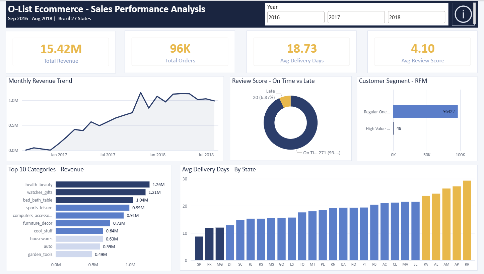

# 🛒 Olist E-Commerce Sales Performance Analysis

> **End-to-end Data Analytics project** analyzing 100,000+ real orders from Olist — Brazil's largest e-commerce platform — to uncover revenue trends, delivery bottlenecks, category performance, and customer behavior patterns.

---

## 📌 Project Overview

| Detail | Info |
|--------|------|
| **Dataset** | Olist Brazilian E-Commerce Public Dataset (Kaggle) |
| **Time Period** | September 2016 — August 2018 |
| **Region** | Brazil — 27 States |
| **Tools Used** | Advanced Excel · MySQL · Power BI |
| **Project Type** | Fresher Data Analyst Portfolio Project |

---

## 🎯 Business Problem

Olist is a Brazilian e-commerce marketplace connecting sellers to customers. As a Data Analyst, the goal was to answer 5 critical business questions:

1. Which months generated the highest and lowest revenue?
2. Which product categories drive the most revenue?
3. Which states have the worst delivery performance?
4. Do late deliveries affect customer satisfaction ratings?
5. Who are Olist's most valuable customers — and are they coming back?

---

## 🗂️ Project Structure

```
Olist-Ecommerce-Analysis/
│
├── SQL_Files/
│   ├── Olist_Setup_and_Query1.sql     # Database setup + Monthly Revenue query
│   ├── Query_2.sql                     # Top 10 Categories by Revenue
│   ├── Query_3.sql                     # Delivery Performance by State
│   ├── Query_4.sql                     # Review Score vs Delivery Status
│   └── Query_5.sql                     # RFM Customer Segmentation
│
├── Query_Result/
│   ├── Query1_Monthly_Revenue.csv
│   ├── Query2_Top_Categories.csv
│   ├── Query3_Delivery_Performance.csv
│   ├── Query4_Review_vs_Delivery.csv
│   ├── Query5_RFM_Segmentation_1.csv
│   └── Query5_RFM_Segmentation_2.csv
│
├── dashboard.pbix                      # Interactive Power BI Dashboard
├── Dashboard.png                       # Dashboard Preview
└── README.md
```

---

## 🔄 Project Workflow

```
Raw Data (Kaggle)
      ↓
Data Cleaning (Advanced Excel)
      ↓
SQL Analysis (MySQL)
      ↓
Dashboard & Insights (Power BI)
      ↓
Business Recommendations
```

---

## 📊 Analysis Phases

### Phase 1 — Data Cleaning (Excel)
- Cleaned all 9 interrelated CSV files
- Handled null values, duplicate entries, and inconsistent city names
- Added time intelligence columns — Delivery_Days, Year, Month Name, Quarter
- Preserved data integrity — raw files never modified

### Phase 2 — SQL Analysis (MySQL)
- Created `olist_db` database and imported all 9 tables
- Used `LOAD DATA INFILE` for large files — 1M+ rows imported in under 10 seconds
- Fixed BOM character issues post-CSV import using `ALTER TABLE RENAME COLUMN`
- Wrote 5 analytical queries covering revenue, categories, delivery, reviews, and customer segmentation
- Applied JOINs, aggregations, CASE statements, subqueries, and RFM logic

### Phase 3 — Dashboard (Power BI)
- Loaded all 5 query result CSVs into Power BI
- Built interactive 2-page dashboard with year slicer (2016, 2017, 2018)
- Created DAX weighted average measure for accurate review score aggregation
- Added Key Findings and Recommendations page with actionable business insights

---

## 💡 Key Findings

| # | Finding |
|---|---------|
| 1 | **Revenue grew 10x in 14 months** — from R$46K in Oct 2016 to R$1.15M in Nov 2017, then stabilised above R$1M through 2018 |
| 2 | **Health & Beauty dominates** — R$1.26M revenue with highest average order value despite fewer orders than Bed Bath & Table |
| 3 | **Late deliveries destroy ratings** — 2.05 avg stars vs 4.25 for on-time — a 52% drop in customer satisfaction |
| 4 | **Massive north-south delivery gap** — São Paulo averages 8.7 days while Roraima takes 29.3 days — more than 3x slower |
| 5 | **Almost all customers are one-time buyers** — 96,422 Regular One-Timers vs only 48 High Value customers — severe retention problem |

---

## 📋 Business Recommendations

**1. Fix delivery in northern states urgently**
Northern states average 25–29 days for delivery. Olist should partner with regional logistics providers or establish fulfillment centers in high-demand cities like Manaus and Belém.

**2. Invest more in Health & Beauty marketing**
Highest revenue category with highest average order value. Increasing seller acquisition and ad spend here could push revenue from R$1.26M to R$2M+ with relatively low effort.

**3. Launch a customer retention program**
With 96,422 one-time buyers and virtually no repeat customers, even a small improvement in retention would have massive revenue impact. Post-purchase email campaigns, discount codes for second orders, and a loyalty points system could significantly increase lifetime value.

---

## 📸 Dashboard Preview



---

## 🗃️ Dataset

- **Source:** [Olist Brazilian E-Commerce Public Dataset — Kaggle](https://www.kaggle.com/datasets/olistbr/brazilian-ecommerce)
- **Size:** 100,000+ orders across 9 interrelated CSV files
- **Period:** 2016 to 2018

---

## 👩‍💻 Author

**Shraddha Muneshwar**
Data Analyst | Computer Engineering Graduate
📍 Mumbai, Maharashtra, India

---

*This project was built as part of a Data Analytics portfolio to demonstrate end-to-end analytical skills including data cleaning, SQL querying, and dashboard creation.*
